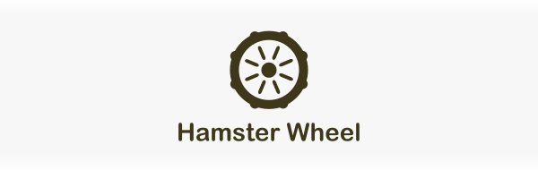

# Hamster Wheel
Hamster wheel is a looping code generator. Generate any text you'd like by specifying some collections and a .hamster_wheel file.

# Usage
Install the Rust crate
```cargo install hamster_wheel```
Then run the command ```hamster_wheel```, and all the .hamster_wheel files in you directory and subdirectories will be processed.

# Templates
Included in ```/templates``` directory are some template files for doing various things in various programming languages. One of the main motivators for Hamster Wheel is to easily generate localization sheets, and so some templates for that are included. If there is something you need to generate and a template is not provided, read on to discover how you can write your own .hamster_wheel files.

# Creating a .hamster_wheel file

An example of a complete file
```
{{ OUTPUT your/output_file.js }}
{{ IMPORT }}
name: yourCollection;
key: 123abc123abc123abc123;
{{ END }}
{{ LOOP(parentIndex) yourCollection as currentRow }}
    Parent Loop number {{ parentIndex }}!
    {{ LOOP currentRow as currentItem }}
        Item: {{ currentItem }}
    {{ END }}
{{ END }}
```

In order for a file to be processed successfully, it must have:
1. The .hamster_wheel extension
2. A specified output file
3. Imports that define collections
4. Loops over the collections
5. Accessors to access the collections

These are described below.

# Output File
The first thing in a .hamster_wheel file must be a declaration of the output file. This is done with the following line:
```
{{ OUTPUT your/output_file.js }}
THE REST OF YOUR CONTENT
```
Note that the above is a valid file. If ```test.hamster_wheel``` has the above content, you will have a file ```your/output_file.js``` that reads: ```THE REST OF YOUR CONTENT```

# Imports
You can import collections in two ways (only csv content is supported).

To import a collection for use in a file, you can import it from a csv file
```
{{ IMPORT }}
name: yourVariableName;
path: you/input_file.csv;
{{ END }}
```
or from Google Sheets
```
{{ IMPORT }}
name: yourOtherVariable;
key: 123abc123abc123abc123;
{{ END }}
```

The ```name``` option must be present in both cases in order to expose it in the scope of the file.
The ```path``` option must be present if you want to import a file on your machine.
The ```key``` option must be specified if you want import a Google Sheet. The ```key``` is the long string in the url of you Google Sheet. In order for Google Sheets to work, the sheet must have a sharable link.
Also, don't forget the semicolons ```;```.

An example file up to this point:
```
{{ OUTPUT your/output_file.js }}
THE REST OF YOUR CONTENT
{{ IMPORT }}
name: yourVariableName;
path: you/input_file.csv;
{{ END }}
```

The imports define the variable in the current scope, where a scope is usually defined by a Loop.

# Loops
Now that you have variables in your scope, you can loop over them using this syntax
```
{{ LOOP yourCollection }}
    YOUR CONTENT
{{ END }}
```
Assuming you have a variable ```yourCollection``` in your scope (and you've specified an output file) the above should output ```YOUR CONTENT``` as many times as the number of rows in your csv file

Hamster wheel supports an array slicing syntax that you can use to take slices of a collection (collections are zero-indexed).

The syntax is ```yourCollection[N, M]``` where M and N are integers or an extreme bound indicator ```..```.

Examples:
```yourCollection[1, ..]```: Loops over ```yourCollection``` and skips the first element.
```yourCollection[2, ..]```: Loops over ```yourCollection``` and skips the first  two elements.
```yourCollection[1, 4]```: Takes the elements from index 1 (inclusive) to 4 (exclusive).
```yourCollection[.., 6]```: Takes all the element from the beginning until index 6 (exclusive).


Example with slicing:
```
{{ LOOP yourCollection[1, ..] }}
    YOUR CONTENT
{{ END }}
```

You can put the following information in your scope for use inside the loop by assigning variable names to them:
1. The loop index: This always starts at zero, and increases by one on each iteration.
2. The collection index: This is the index that is currently being used to access the collection. Meaning if you are looping on ```yourCollection[5, ..]``` the collection index starts at 5, and increases by one on each iteration.
3. The current item: This is simply ```yourCollection[collectionIndex]```.

You can assign them to variables using the following syntax
```
{{ LOOP(loopIndex, collectionIndex) yourCollection[1, ..] as currentItem }}
    YOUR CONTENT
{{ END }}
```
Note that ```collectionIndex``` can be omitted by just specifying ```LOOP (loopIndex)``` instead of ```LOOP (loopIndex, collectionIndex)```

An example of looping on all the items in the csv file:
```
{{ LOOP(parentIndex) yourCollection as currentRow }}
    Parent Loop number {{ parentIndex }}!
    {{ LOOP currentRow as currentItem }}
        Item: {{ currentItem }}
    {{ END }}
{{ END }}
```

In this example, we access ```currentItem``` and display it.

# Accessors
As seen above, to access an item, you can use
```
{{ currentItem }}
```

You can also use brackets to access arrays, as in ```yourCollection[2]```.
Another way we could have written the example above is a follows:
```
{{ LOOP(parentIndex, parentCollectionIndex) yourCollection}}
    Parent Loop {{ parentIndex }}!
    {{ LOOP(loopIndex, collectionIndex) yourCollection[parentCollectionIndex] }}
        Item: {{ yourCollection[parentCollectionIndex][collectionIndex] }}
    {{ END }}
{{ END }}
```

Using the ```as yourVariable``` syntax is much more concise and so is recommended, but this example shows a different way you can do things.

# And That's That
Now that you know the syntax and how to use it, you can go ahead and loop over collections to you heart's content.
